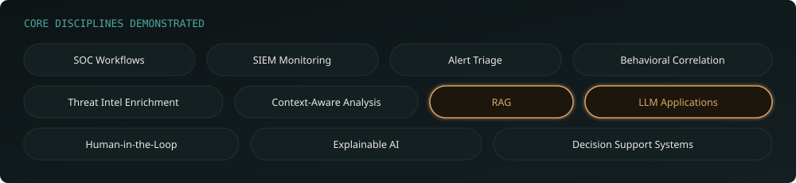
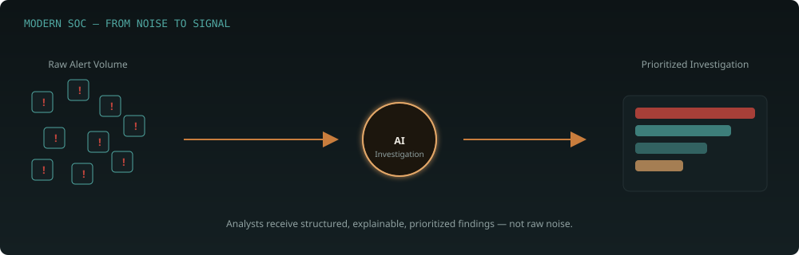
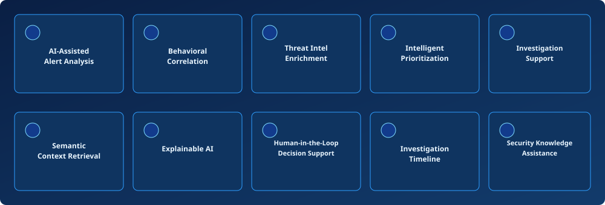
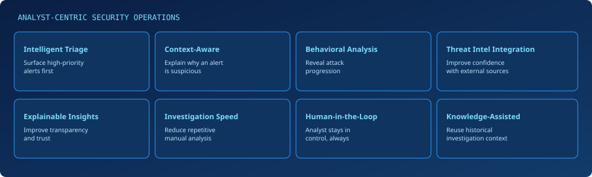
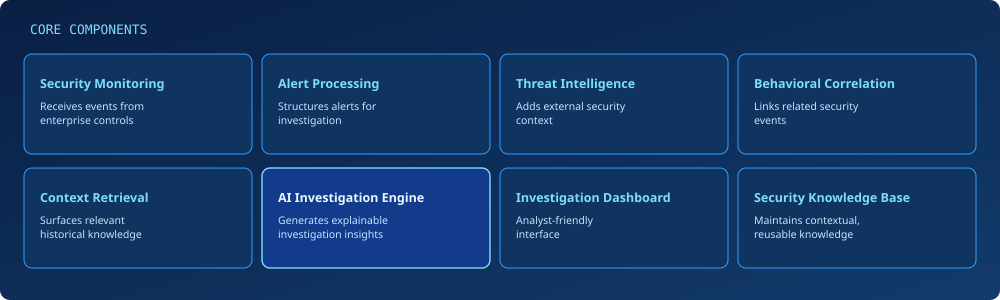
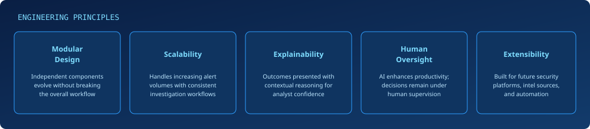

<!--
=====================================================================
README.md — AI-Powered SOC Assistant
All original written content preserved verbatim. Formatting, visual
hierarchy, and 13 custom SVGs added per the design brief.

SETUP:
1. Create /assets folder in repo root, upload all 13 SVG files listed
   in the "SVG Asset Manifest" section at the bottom of this file.
2. Place this file as README.md in the repo root.
3. Fill in roadmap-timeline.svg milestones with real, verified plans.
=====================================================================
-->

 

## Project Overview

Modern Security Operations Centers (SOCs) operate in environments where security monitoring platforms continuously generate large volumes of alerts from endpoints, servers, network devices, and security controls. While these alerts provide valuable visibility, analysts often spend significant time separating legitimate threats from operational noise.

The AI-powered SOC Assistant is designed as an analyst-assistance platform that enhances security investigations through intelligent analysis rather than rule-only processing. By combining contextual understanding, behavioral correlation, semantic retrieval, and threat intelligence enrichment, the platform transforms raw security alerts into meaningful investigation outcomes that support faster and more informed decision-making.

Instead of presenting isolated alerts, the platform focuses on identifying relationships between security events, highlighting suspicious behavioral patterns, retrieving relevant contextual knowledge, and generating analyst-friendly explanations that simplify complex investigations.

### Objectives

- Accelerate SOC alert triage and investigation workflows.
- Reduce analyst workload by prioritizing meaningful security events.
- Improve contextual understanding of security alerts through AI-assisted reasoning.
- Support behavioral investigation instead of isolated event analysis.
- Enhance analyst productivity using explainable security insights.
- Integrate threat intelligence into investigation workflows.
- Promote human-in-the-loop decision making for trustworthy security operations.
- Demonstrate a scalable architecture suitable for modern AI-assisted Security Operations Centers.

 

## What This Project Demonstrates

This repository showcases the design of a modern AI-assisted SOC platform that combines cybersecurity operations with Artificial Intelligence to support real-world investigation workflows.

The project demonstrates practical understanding of:

- Security Operations Center (SOC) workflows
- SIEM-based security monitoring
- Alert triage and prioritization
- Behavioral correlation
- Threat intelligence enrichment
- Context-aware security analysis
- Retrieval-Augmented Generation (RAG)
- Large Language Model (LLM) applications in cybersecurity
- Human-in-the-loop security decision support
- Explainable AI for security investigations

 

## Why This Project?

Security Operations Centers (SOCs) are responsible for continuously monitoring organizational environments to detect, investigate, and respond to cyber threats. As enterprise infrastructures continue to grow, security monitoring platforms generate an overwhelming number of alerts every day. Many of these alerts represent benign activities, duplicate events, or low-priority incidents, making it increasingly difficult for analysts to identify genuine security threats quickly.

Traditional SIEM-centric workflows primarily rely on rule-based detections and manual investigation. Although effective for known attack patterns, these approaches often struggle to provide contextual understanding, correlate related activities, or explain why an alert should be prioritized. As a result, analysts spend significant time performing repetitive investigations instead of focusing on high-impact security incidents.

This project explores how Artificial Intelligence can augment modern Security Operations Centers by assisting analysts throughout the investigation lifecycle. Rather than simply displaying alerts, the platform provides contextual reasoning, behavioral analysis, intelligent prioritization, and investigation guidance to improve operational efficiency while preserving analyst oversight.

The platform follows a **Human-in-the-Loop** approach, ensuring that AI supports security analysts without replacing human expertise or decision-making.

**Problems Addressed**

- High alert volumes in enterprise environments
- Alert fatigue caused by repetitive investigations
- Limited contextual understanding of isolated alerts
- Manual correlation across multiple security events
- Slow incident triage and prioritization
- Inconsistent investigation workflows
- Time-consuming security analysis
- Limited explainability in traditional detection systems

**Vision**

To demonstrate how AI-assisted investigation workflows can improve Security Operations Center efficiency by transforming raw security alerts into contextual, explainable, and actionable security intelligence.

 

## Key Capabilities

The AI-powered SOC Assistant is designed around analyst-centric workflows commonly found in modern Security Operations Centers. Instead of replacing existing security monitoring platforms, the system enhances investigation quality by providing additional context, intelligent reasoning, and actionable insights.

<b>Expand full capability descriptions</b>

 

**AI-Assisted Alert Analysis** — Analyze security alerts with contextual understanding instead of relying solely on static detection rules.

**Behavioral Correlation** — Identify relationships between multiple security events to uncover attack progression and suspicious behavioral patterns.

**Threat Intelligence Enrichment** — Enhance investigations with external reputation data, contextual intelligence, and additional security insights.

**Intelligent Alert Prioritization** — Help analysts focus on the most relevant security events by highlighting alerts requiring immediate attention.

**Incident Investigation Support** — Provide analyst-friendly explanations and investigation guidance throughout the incident response process.

**Semantic Context Retrieval** — Retrieve relevant historical security knowledge to improve contextual understanding during investigations.

**Explainable AI** — Generate transparent investigation summaries that help analysts understand why specific alerts require attention.

**Human-in-the-Loop Decision Support** — Assist security analysts while ensuring that final security decisions always remain under human control.

**Investigation Timeline** — Present related security activities as structured investigation timelines to improve incident visibility.

**Security Knowledge Assistance** — Support analysts with natural language interaction for understanding alerts, investigation findings, and security context.

 

## Modern SOC Capabilities

Modern Security Operations Centers require more than traditional alert monitoring. Effective security teams rely on contextual analysis, behavioral investigation, threat intelligence, and intelligent decision support to rapidly identify and respond to evolving cyber threats.

This project demonstrates how Artificial Intelligence can augment modern SOC workflows by improving investigation efficiency, reducing repetitive manual analysis, and providing contextual security insights without replacing the expertise of human analysts.

**Analyst-Centric Security Operations** — the platform is designed to support security analysts throughout the investigation lifecycle by providing meaningful context instead of simply displaying security events.

 

## System Architecture

The AI-powered SOC Assistant follows a modular architecture designed around modern Security Operations Center workflows. Each component contributes to transforming raw security alerts into meaningful investigation outcomes while maintaining scalability, flexibility, and analyst control.

**Architectural Principles**

| Principle | Description |
|---|---|
| **Modular Design** | The platform is organized into independent functional components, allowing individual capabilities to evolve without affecting the overall workflow. |
| **Scalability** | The architecture is designed to accommodate increasing alert volumes while maintaining consistent investigation workflows. |
| **Explainability** | Investigation outcomes are presented with contextual reasoning to improve analyst understanding and decision confidence. |
| **Human Oversight** | Artificial Intelligence enhances analyst productivity while ensuring that all security decisions remain under human supervision. |
| **Extensibility** | The architecture is designed to support future integration with additional security platforms, intelligence sources, and automation capabilities. |

 

## Investigation Workflow

The AI-powered SOC Assistant follows a structured investigation workflow designed to assist security analysts from initial alert ingestion to final incident assessment. Rather than treating alerts as isolated events, the platform organizes relevant security context into a logical investigation process that improves efficiency, consistency, and decision quality.

**Workflow Objectives**

- Organize security investigations into a structured process.
- Improve analyst efficiency through contextual investigation support.
- Correlate related security events for enhanced visibility.
- Reduce repetitive manual analysis.
- Provide explainable AI-assisted investigation results.
- Keep security analysts responsible for final decisions.

**Investigation Outcomes** — the investigation workflow enables analysts to:

- Understand the context surrounding an alert.
- Identify related security activities.
- Review behavioral relationships between events.
- Access enriched security intelligence.
- Receive AI-assisted investigation summaries.
- Make informed incident response decisions.

 

## Core Components

The platform is composed of multiple functional components that collectively support modern Security Operations Center workflows. Each component focuses on a specific responsibility while contributing to an integrated investigation experience.

 

## Technology Stack

The project combines modern cybersecurity technologies, backend services, Artificial Intelligence, and data management components to demonstrate an AI-assisted Security Operations Center architecture.

| Category | Technologies |
|---|---|
| **Security Operations** | Wazuh SIEM · Sysmon · Suricata IDS · MITRE ATT&CK Framework |
| **Artificial Intelligence** | Large Language Models (LLMs) · Retrieval-Augmented Generation (RAG) · LangGraph · Vector Embeddings |
| **Backend** | FastAPI · Python · RESTful APIs |
| **Data Management** | PostgreSQL · ChromaDB |
| **Frontend** | React · HTML5 · CSS3 · Chart.js · WebSocket |
| **Threat Intelligence** | VirusTotal · AbuseIPDB |
| **Development Environment** | VMware Workstation · Windows Server · Ubuntu Linux |

 

## AI Investigation Pipeline

Artificial Intelligence enhances the investigation workflow by combining contextual understanding, semantic retrieval, and explainable reasoning. Rather than replacing analyst expertise, AI acts as an intelligent investigation assistant that provides additional context for informed security decisions.

**AI Investigation Goals**

- Improve investigation consistency.
- Reduce repetitive manual analysis.
- Enhance contextual understanding.
- Generate explainable investigation findings.
- Support analyst decision-making.
- Accelerate security investigations while maintaining transparency.

 

## Engineering Highlights

 

 

